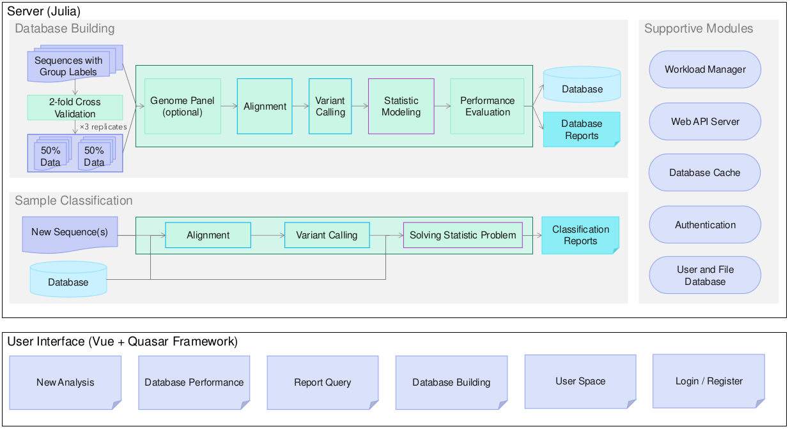

# Algorithm

Clasnip is a fast, sound and reliable bioinformatics classifier that can facilitate the detection of pathogens, and it is important for disease containment and cost reductions for quick reaction in case of an outbreak or invasion of an exotic plant disease. 

Clasnip was programmed to classify DNA sequences of closely-related microorganisms, and generate an SNP table with a pre-processed database. 

The **framework** of Clasnip is illustrated as below. The **back-end (server)** and the **front-end (web interface)** are two separated programs. All classification tasks are done at the server side, including database building and new sample classification. The user-interface is only used for display purposes.

Please read our paper for details [1].

1. Chuan J, Xu H, Hammill DL, Hale L, Chen W, Li X. 2023. Clasnip: a web-based intraspecies classifier and multi-locus sequence typing for pathogenic microorganisms using fragmented sequences. PeerJ 11:e14490 https://doi.org/10.7717/peerj.14490

