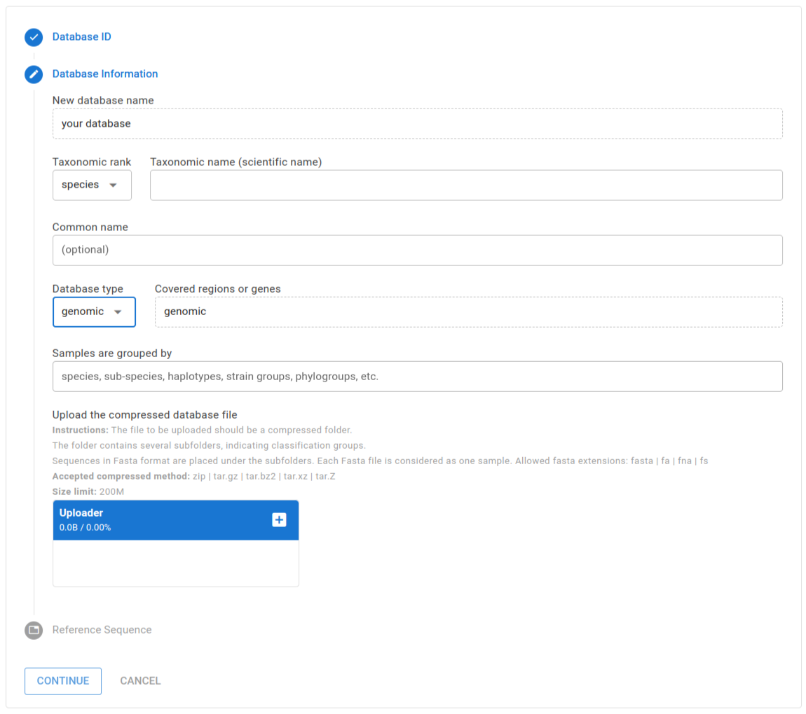
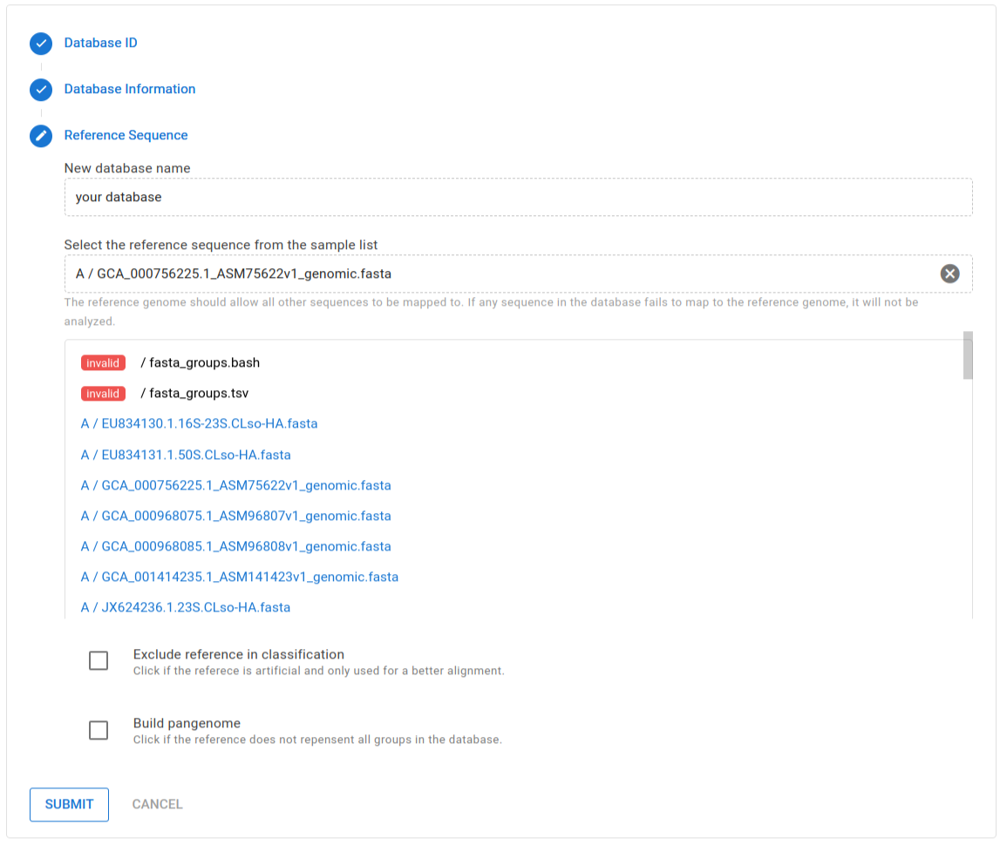

# Creating new database

Clasnip performs sample classification based on specialized databases. The Clasnip database is constructed with input samples with group labels, and one of the samples is marked as a reference. An input sample is a nucleotide sequence, or a collection of nucleotide sequences in the FASTA format. A sample can have sequences of a single gene, multiple genes, contigs, or even a genome. Users do not need to create any alignment file before submitting.

To create a database, you need to **sign up** (it is free.), and **log in** to your account. Then, select **Menu** (top bar) -> **Create Database**.

## Database information

To create a Clasnip database, users need to provide the following information:

- **Database ID**: It is a unique name to the database. Avoid special characters.
  
- **Taxonomic rank**: Select one of the items: genus, species, strain.
- **Taxonomic name (scientific name)**: The official scientific name describing all sequences in the database.
- **Common name**: Optional.
- **Database type**: Select one from the items:
  - **genomic**: It is a genomic database. Samples in the database contain genomic sequences, but some samples may be genes or fragments.
  - **genomic - all samples are assemblies**: It is a genomic database, and all samples are whole genome sequences (contigs, scaffolds, or complete genomes).
  - **multiple genes**: The database contain samples with more than one genes.
  - **single gene**: The database contain samples with only one gene.
- **Covered regions or genes**: If database type is multiple genes or single gene, you need to enter what regions or genes are included in the database.
- **Database file**: See below.
  

## Database file

You need to upload a **compressed** database folder to Clasnip. The folder shall contain several sub-folders holding sequences in FASTA format. Each **sub-folder** is considered as a group, and each **FASTA file** is considered as a sample.

!!! details "What is the FASTA format?"
    A sequence in FASTA format begins with a single-line description, followed by lines of sequence data. The description line (defline) is distinguished from the sequence data by a greater-than (">") symbol at the beginning. An example sequence in FASTA format is:

    ```fasta
    >Name1 description
    GTTGATGGGGTCATTTGAGTTTATGTTAAGGGCCCATAG
    CTCAGGCGGTTAGAGTGCACCC
    >Name2 description
    ATAGTTTTTTTGTTCTAGGGATTTTTTTTTAGAGCAATA
    ```


The tree view of the compressed folder looks like this:

```
Pectobacteria_database.zip
├── Pectobacterium_actinidiae
│   ├── GCA_000803315.1_ASM80331v1_genomic.fasta
│   ├── GCA_007833835.1_ASM783383v1_genomic.fasta
│   ├── GCA_017426805.1_Pca_genomic.fasta
│   └── GCA_024343335.1_ASM2434333v1_genomic.fasta
├── Pectobacterium_aquaticum
│   ├── GCA_002869945.1_ASM286994v1_genomic.fasta
│   ├── GCA_003382565.3_ASM338256v3_genomic.fasta
├── Pectobacterium_aroidearum
│   ├── GCA_000023605.1_ASM2360v1_genomic.fasta
│   ├── GCA_013449715.1_ASM1344971v1_genomic.fasta
│   ├── GCA_013913605.1_ASM1391360v1_genomic.fasta
```

In the example, the database contain three groups, named `Pectobacterium_actinidiae`, `Pectobacterium_aquaticum`, and `Pectobacterium_aroidearum` . Those groups have 4, 2 and 3 samples,respectively.

!!! info "Specs of a database file"
    - **Accepted compressed methods for database file**: `zip`, `tar.gz`, `tar.bz2`, `tar.xz`, `tar.Z`
    - **Allowed FASTA file extensions**: `fasta`, `fa`, `fna`, `fs`. FASTA should not be compressed. 
    - **Nested folders are allowed**: `Group_A/Group_A1/Sample` is valid, and the group of Sample is automatically converted to `Group_A/Group_A1`
    - **Database size limit**: 200M, or shown in Clasnip.com.


## Reference sequence

After uploading the database file, user need to select a reference sequence from the FASTA files. The reference should allow all other sequences to be mapped to. If any sequence fails to map to the reference, it will not be analyzed. If a sample barely maps to the reference, the classification performance will be compromised.



If the samples are too diverse to be mapped using a single reference, we can

- Click "**build pangenome**". This function is useful when no reference sequence can represent all groups in the database. You can choose one reference sequence, and a pangenome will be built based on the sequence. The unmapped region of other sequences will be appended to the pangenome, and the pangenome will be the reference genome.
- If the previous method does not generate good mapping results, you can also **manually create a pangenome**, and added the pangenome as a normal FASTA file in the database. Select this as reference, and click "**exclude reference in classification**". This option is useful when the reference is artificial and only used for a better alignment.

### Submit

Congratualtions! You are all set. Now you can click "**SUBMIT**" to create the database. It may take some time depending on sequence lengths. You can go to the report page to see whether the task is finished.

After the task is finished, you can review the detailed database information by selecting **Menu** (top bar) -> **Database Information**.
