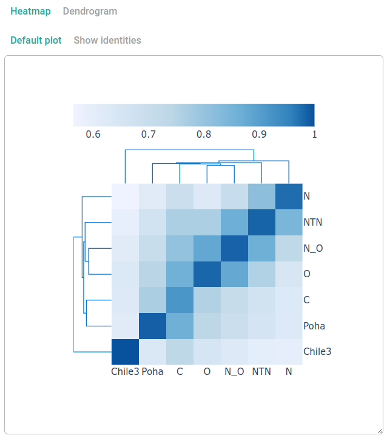
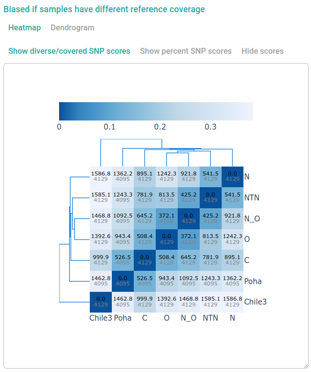
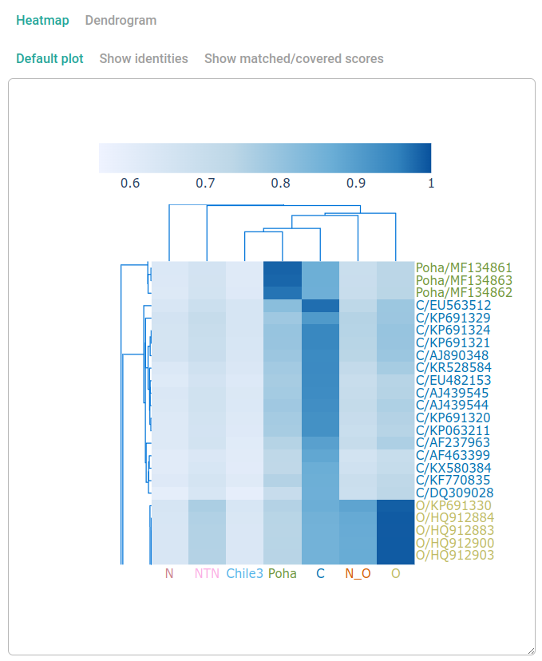

# Clasnip Database Information

Clasnip performs sample classification based on specialized databases. When creating a database, Clasnip automatically analyzes performance based on the samples in the database. The database information and performance reports are accessible by all users. 

To browse database information and performance reports, go to **Menu** (top bar) -> **Database Information** -> **Choose A Clasnip Database**.

## Database information

### Metadata

Database metadata includes:

- **Database ID**: The unique ID of clasnip database.
- **Taxonomy**: Ccientific name, and taxonomy level.
- **Group By**: What are the samples grouped by? Eg: species, stains, haplotypes.
- **Region**: What region/genes are covered?
- **Reference Sequence**: The reference sequence used for mapping. If it contains `.pan.`, it is a pan-genome containing not only the reference sequence, but also unmapped regions from other samples. 
- **Created By**: A user who creates the database.
- **Date Created**: Date in the format of `YYYY-MM-DD`.

### Classification groups

This section lists classification groups in the database.

### Accuracy

The percent of accuracy computed based on the samples in the database.

```math
Accuracy = \frac{TP + TN}{TP + TN + FP + FN}
```

where

- **TP** (True Positive) = Group X sample correctly identified as X.
- **TN** (True Negative) = Non group X sample correctly identified as not X.
- **FP** (False Positive) = Non group X sample incorrectly identified as X.
- **FN** (False Negative) = Group X sample incorrectly identified as not X.

## Detailed classification performance

### Heatmaps and dendrograms

Several plots were generated using different data in the forms of heatmap and dendrogram. Plots may automatically hided, you need to click "**Dendrogram**", or the sub-buttons under **Heatmap** to view the plot. 

The plots are interactive, and you can

- **resize the plot** by dragging the bottom-right corner of the canvas.
- **hover** on heatmap cells to show the description of X and Y axes, and numbers. 
- **zoom** or **pan** plots using mouse.
- **quick double click** for auto scale.

!!! warning
    Some plots might be very big and take a while to show and resize.


#### Group Similarity Based on Sample Identities



The number in the cell is the mean group identity among samples belong to labeled group. X and Y axes all represent groups, but they are a little bit difference. Y axis is the labeled group (true classification), and X axis is the group shown in classification report.

#### Group Similarity Based on SNP Differences



The cells are colored with the percent of diverse SNP scores (dark) over covered SNP scores (grey) among two groups. 

!!! note "The term, SNP, used in Clasnip"
    Clasnip treats SNP, insert and deletion in the same way, and does not distinguish them when computing SNP scores. So the term "SNP" used in Clasnip includes both SNP and INDEL.


#### Sample Similarity Based on Classification



> The Y axis of the figure above is partially displayed.

The heatmap shows the cluster of samples (Y axis) and groups (X axis) in the database. Samples are colored by the classification provided by the database submitter. Cells are colored by identities (percent matched). 

#### Identity Quantile Statistics for Each Group

| #    | LABELED GROUP | N SAMPLE | N ACCURATE | IDENTITY Q5 | IDENTITY Q25 | IDENTITY MEDIAN | TRUE POSITIVE RATE |
| ---- | ------------- | -------- | ---------- | ----------- | ------------ | --------------- | ------------------ |
| 1    | C             | 16       | 16         | 0.864       | 0.892        | 0.929           | 1                  |
| 2    | Chile3        | 1        | 1          | 1           | 1            | 1               | 1                  |
| 3    | N             | 31       | 31         | 0.93        | 0.969        | 0.985           | 1                  |
| 4    | NTN           | 73       | 73         | 0.957       | 0.969        | 0.991           | 1                  |
| 5    | N_O           | 37       | 37         | 0.954       | 0.984        | 0.987           | 1                  |
| 6    | O             | 87       | 87         | 0.956       | 0.977        | 0.982           | 1                  |
| 7    | Poha          | 6        | 6          | 0.972       | 0.982        | 0.99            | 1                  |

- **LABELED GROUP**: the group labeled in database.

- **N SAMPLE**: the total number of samples with SNP coverage no less than 5. If all samples' coverages are less than 5, all samples are used.

- **N ACCURATE**: the number of samples correctly classified as the labeled group.

- **IDENTITY Q5/25**: the 5/25th quantile of samples' identities belongs to the labeled group.
- **IDENTITY MEDIAN**: the 50th quantile of samples' identities belongs to the labeled group.

- **TRUE POSITIVE RATE (SENSITIVITY)**: the rate of N ACCURATE to N SAMPLE.

#### Classification Performance

| #    | LABELED GROUP | TPR  | TNR  | PPV  | NPV  | FNR  | FPR  | FDR  | FOR  | ACC  | F1   |
| ---- | ------------- | ---- | ---- | ---- | ---- | ---- | ---- | ---- | ---- | ---- | ---- |
| 1    | C             | 1    | 1    | 1    | 1    | 0    | 0    | 0    | 0    | 1    | 1    |
| 2    | Chile3        | 1    | 1    | 1    | 1    | 0    | 0    | 0    | 0    | 1    | 1    |
| 3    | N             | 1    | 1    | 1    | 1    | 0    | 0    | 0    | 0    | 1    | 1    |
| 4    | NTN           | 1    | 1    | 1    | 1    | 0    | 0    | 0    | 0    | 1    | 1    |
| 5    | N_O           | 1    | 1    | 1    | 1    | 0    | 0    | 0    | 0    | 1    | 1    |
| 6    | O             | 1    | 1    | 1    | 1    | 0    | 0    | 0    | 0    | 1    | 1    |
| 7    | Poha          | 1    | 1    | 1    | 1    | 0    | 0    | 0    | 0    | 1    | 1    |

[The terminology and derivations can be found at this page.](https://en.wikipedia.org/wiki/Sensitivity_and_specificity)

- **TP (True Positive)**: a test result that correctly indicates the presence of a condition or characteristic.

- **TN (True Negative)**: a test result that correctly indicates the absence of a condition or characteristic.

- **FP (False Positive)**: a test result which wrongly indicates that a particular condition or attribute is present.

- **FN (False Negative)**: a test result which wrongly indicates that a particular condition or attribute is absent.

- **TPR (Sensitivity, Recall, Hit Rate, True Positive Rate)**: ``TP / (TP + FN)``.

- **TNR (Specificity, Selectivity, True Negative Rate)**: ``TN / (TN + FP)``.

- **PPV (Precision, Positive Predictive Value)**: ``TP / (TP + FP)``.

- **NPV (Negative Predictive Value)**: ``TN / (TN + FN)``.

- **FNR (Miss Rate, False Negative Rate)**: ``1 - TPR``.

- **FPR (Fall-out, False Positive Rate)**: ``1 - TNR``.

- **FDR (False Discovery Rate)**: ``1 - PPV``.

- **FOR (False Omission Rate)**: ``1 - NPV``.

- **ACC (Accuracy)**: ``(TP + TN) / (TP + TN + FP + FN)``.

- **F1 Score**: the harmonic mean of precision and sensitivity.

!!!  info "Cross-validation"
    In addition, if a database is a *single-gene* database, or "*all samples are assemblies*" is selected when creating database, Clasnip will evaluate the database comprehensively using cross-validation.  
    
    Cross-validation is a technique used to assess a classifier model and test its performance without overfitting. Clasnip uses three replicates of 2-fold cross-validation. In a 2-fold cross-validation, samples are evenly divided into two groups. The first group is used to train the model (training set), and the second group is used to test the model (test set). After recording the performance, it will use the second group as the training set, and the first group as the test set. Clasnip does three replications and summarize the performance of training and test sets. Standard deviation is shown in each cell.  
    
    Also, if a group has only one sample, this group is excluded in cross-validation.

#### Mis-classified Samples

This table summarizes mis-classified samples. It is useful when evaluating the database performance and checking what samples were misclassified. Sometimes, a public databases will give a wrong label for a sample, and database maintainers can double check the labels when using other methods.

The columns of this table is similar to classification results. 

- **GROUP**: the group labeled in database.

- **PERCENT MATCHED**: sequence identity, the ratio of MATCHED SNP SCORE and COVERED SNP SCORE.

- **MATCHED SNP SCORE**: sum of scores of all matched SNPs.

- **COVERED SNP SCORE**: sum of scores of all matched and unmatched SNPs.

- **RANK**: the rank of PERCENT MATCHED for the LABELED GROUP.

- **LABEL**: format in LABELED GROUP/SAMPLE NAME.

- **CDF**: the cumulated density where PERCENT MATCHED falls in which quantile of estimated distribution of LABELED GROUP samples in database.

- **PROBABILITY**: the probability of the sample is classified to LABELED GROUP.

If **COVERED SNP SCORE** is small, it probably means insufficient SNPs were covered by your query sequences, so **PERCENT MATCHED** may be stochastic and not predicted precisely.

The classification accuracy is based on the provided samples and labels, and not guaranteed by Clasnip.

#### Low Coverage Samples

This table shows samples with low coverages (eg: **COVERED SNP SCORE** < 5). A sample has a low coverage usually means it is unable to successfully map to the reference sequence. If unintentionally, database maintainers may use a better reference sequence, or select "**build pangenome**", or manually provide a pangenome when building a Clasnip database.