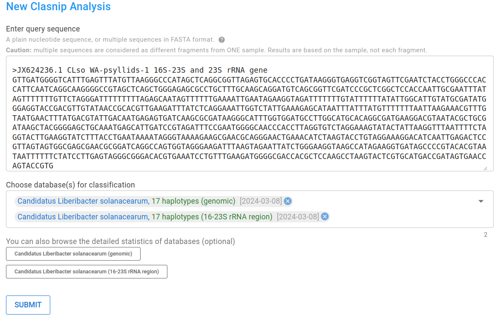
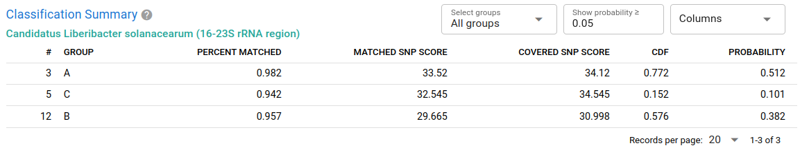
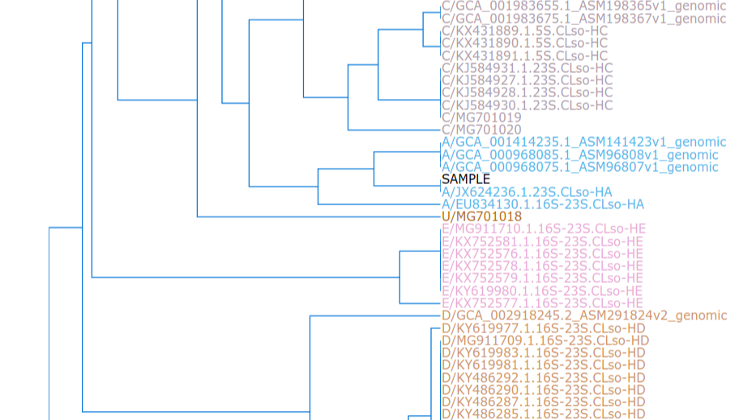
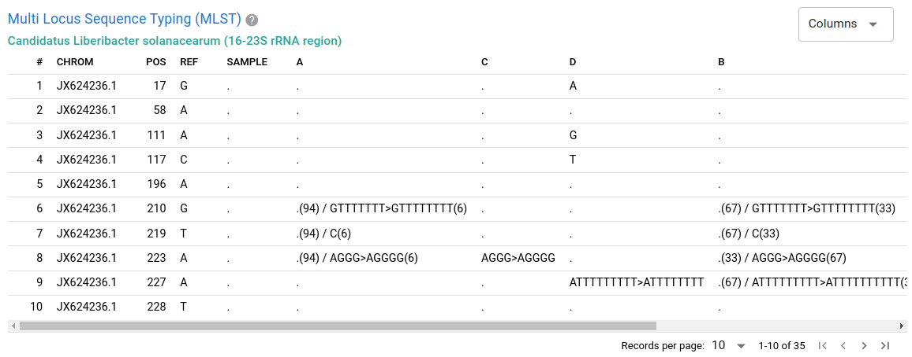
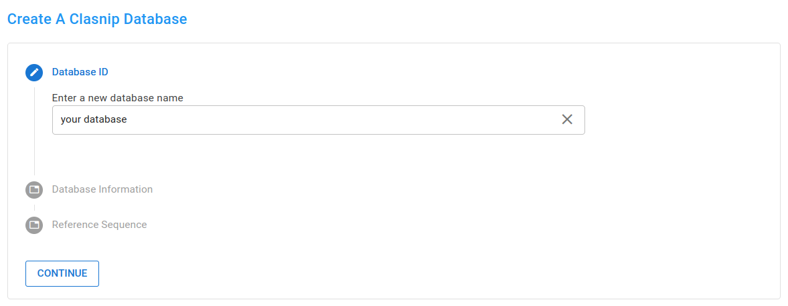
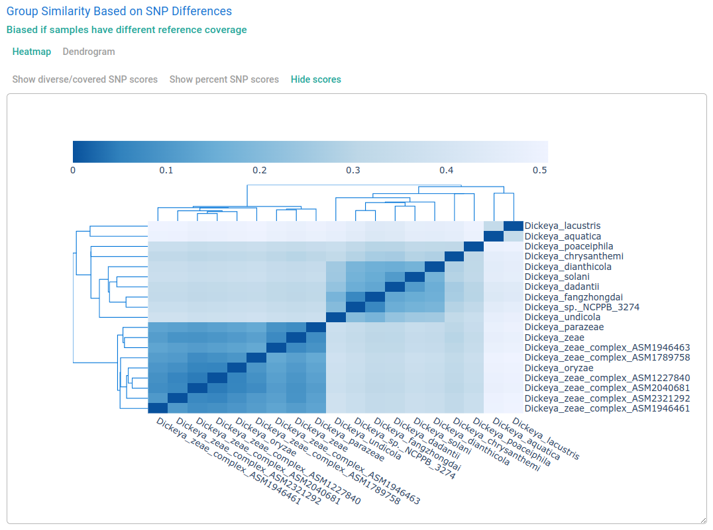
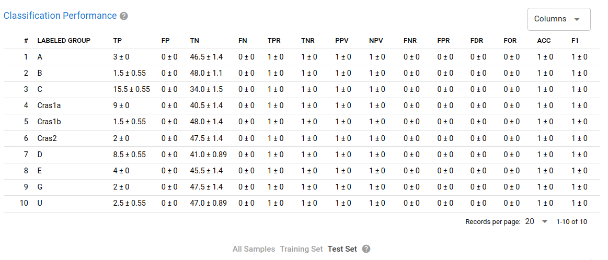

# Clasnip Documentation

Clasnip (www.clasnip.com) is an easy-to-use web-based platform for the classification and similarity evaluation of closely related microorganisms at **interspecies** and **intraspecies** levels.

At the current stage, it provides reliable classification for **quarantine and regulatory pathogens**.

## Citation and technical details

Chuan J, Xu H, Hammill DL, Hale L, Chen W, Li X. 2023. Clasnip: a web-based intraspecies classifier and multi-locus sequence typing for pathogenic microorganisms using fragmented sequences. PeerJ 11:e14490 [https://doi.org/10.7717/peerj.14490](https://doi.org/10.7717/peerj.14490)

## Features

### Just input nucleotide(s) and choose databases.

- No matter they are PCR-amplicons, genes, fragmented sequences, contigs, or even whole genomes, as long as they share similarity with databases.
- No need to align or truncate sequences.
  

### Clear classification report with visualizations

- Tabular classification summary
  

- Dendrogram and heatmap show the placement of your sample
  

- MLST table showing SNP/INDEL and their prevalence in database
  

### Database of your interest not found?

**Create one by yourself, and review classification performance in a glance like an expert** *(login required)*

- Guided database-creating experience
  

- Auto-generated heatmaps and dendrograms
  

- Review performances (TPR / sensitivity, TNR / specificity, etc.)
  
