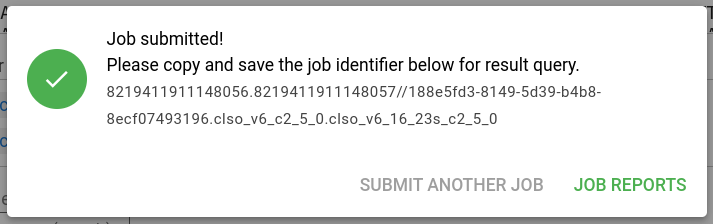

# New Analysis

To submit a new Clasnip analysis, go to **Menu** (top bar) -> **New Analysis**. The New Analysis page looks like:


Users need to enter query sequence(s) and choose database(s).

!!! info "Query Sequence"
    A plain nucleotide sequence, or multiple sequences in **FASTA** format.
    
    Caution: multiple sequences are considered as different fragments from ONE sample. Results are based on the sample, not each fragment.
    
    !!! details "What is the FASTA format?"
        A FASTA file can contain more than one sequences. A sequence begins with a single-line description, followed by lines of sequence data. The description line (defline) is distinguished from the sequence data by a greater-than (`>`) symbol at the beginning. An example sequence in FASTA format is:
    
        ```
        >Name1 description
        GTTGATGGGGTCATTTGAGTTTATGTTAAGGGCCCATAG
        CTCAGGCGGTTAGAGTGCACCC
        >Name2 description
        ATAGTTTTTTTGTTCTAGGGATTTTTTTTTAGAGCAATA
        ```

!!! info "Choose database(s)"
    Users need to choose a database (or multiple databases) from the database list. The database should fit the description of the sequence.
    
    If microorganisms of interest not found in existing databases, you can create your own database.

After entering sequences and choosing databases, you can click "SUBMIT" to submit the job. If successful, you will see a window pop-up as below. 



You need to save the job identifier to a safe place for result query. If you have logged in, the job will be stored in your user space, otherwise you have to enter the job ID.

Then, you can click "JOB REPORTS" to navigate to the report page.
