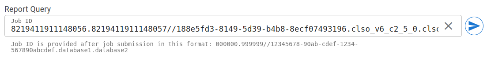
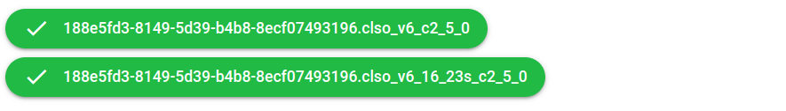
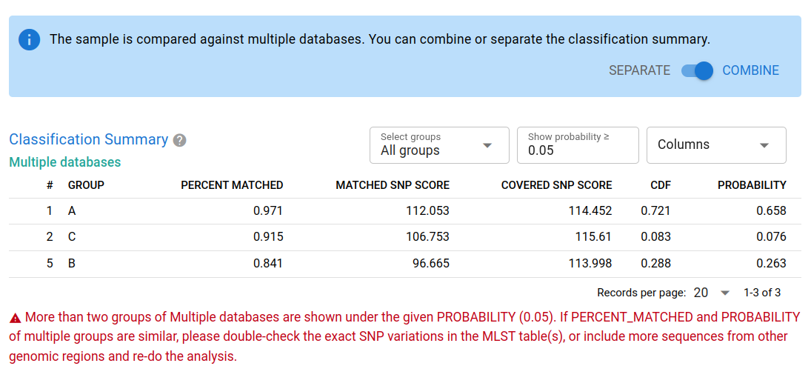
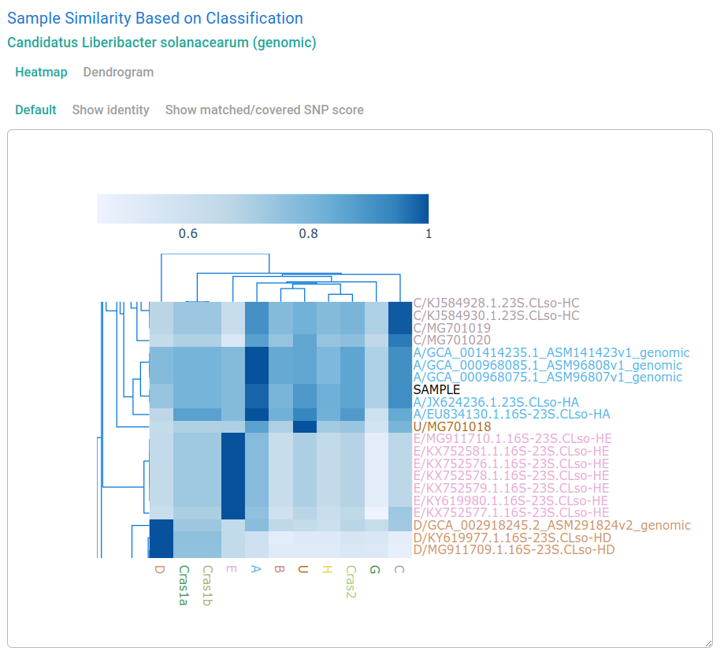
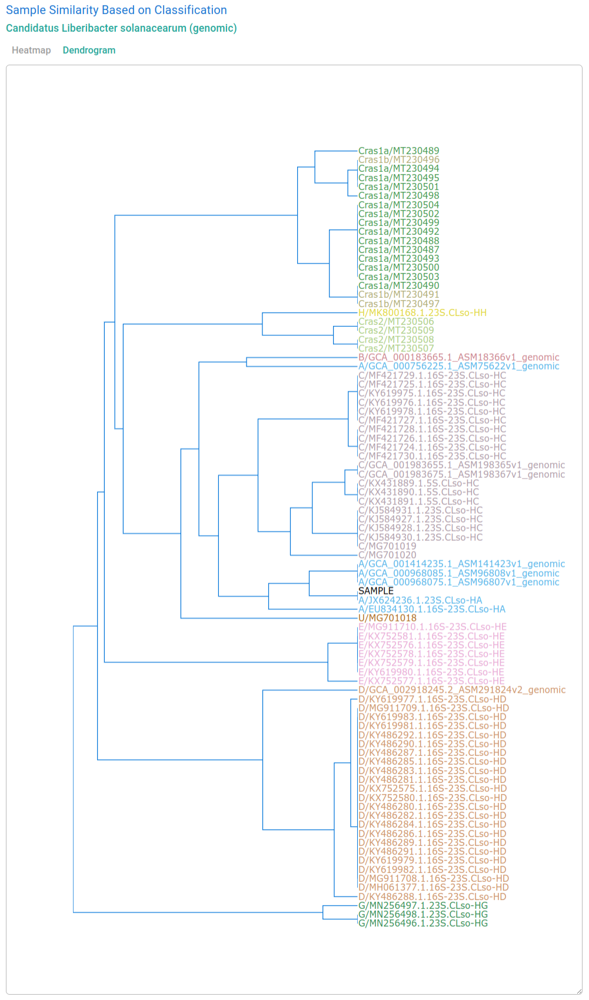

# Clasnip Classification Reports

After you submit a Clasnip job, you can go to **Menu** (top bar) -> **Reports** to query job status and analysis reports using a job ID. 

The last job's ID is saved here, you can press ENTER or the send button on the right.



!!! details "Format of Job ID"
    ```
    [TASK-ID[.TASK-ID...]//]SEQUENCE-UUID.DATABASE-ID[.DATABASE-ID...]
    ```
    - **TASK-ID**: (Optional) a numeric task ID related to the job. It may expire because Clasnip cleans task information regulary.
    - **SEQUENCE-UUID**: A label used to uniquely identify the sample in Clasnip.
    - **DATABASE-ID**: A database ID. Even if the database is updated with a newer ID, the old job report is still accessible using the old database ID.
    - **`[]`**: Enclosed content is optional.
    - **`...`**: Multiple occurances allowed.

## Job Status



The jobs related to the query are shown above. You can hover on a job to see the detailed status. Status can be one of

- **queuing**: the job is waiting in queue.
- **running**: the job is started.
- **done**: the job is finished.
- **failed**: the job is failed. 
- **cancelled**: the job is cancelled due to an unknown condition.

> If you found your job is failed or cancelled, please don't hesitate to raise an issue at [the Clasnip.com Github repository](https://github.com/cihga39871/Clasnip.com/issues).

## Classification Summary

A typical classification summary page is shown below. 



### Combine multiple databases

If you choose more than one database, you will see the blue info section above Classification Summary. In the section, you can use the switch (**SEPARATE** or **COMBINE**) to manage how the classification summary displayed.

> If you only compare your sequence with one database, you will not see the blue info asking you to separate or combine the classification summary.

### Descriptions of columns

- **PERCENT MATCHED**: sequence identity. The ratio of **MATCHED SNP SCORE** over **COVERED SNP SCORE**.

- **MATCHED SNP SCORE**: sum of scores of all matched SNPs and INDELs.

- **COVERED SNP SCORE**: SNP coverage. Sum of scores of all matched and unmatched SNPs and INDELs.

- **CDF**: probability within **GROUP**. The percent of samples in this **GROUP** has lower sequence identity than the input sample.

- **PROBABILITY**: the likelihood of the sample is classified to this **GROUP**.

!!! note "The term, SNP, used in Clasnip"
    Clasnip treats SNP, insert and deletion in the same way, and does not distinguish them when computing SNP scores. So the term "SNP" used in Clasnip includes both SNP and INDEL.

If the deviation of two groups' **PERCENT MATCHED** are small, please double-check the exact SNP variations in the MLST table.

If **COVERED SNP SCORE** is small, it probably means insufficient SNPs were covered by your query sequences, so **PERCENT MATCHED** may be stochastic and not predicted precisely.

### Options to filter results

- **Show probability ≥ _number_**: Filter rows using the criteria of probability. Set to 0 to show all rows.
- **Select groups**: Select groups to include in the analysis. Unselecting a group means the group can be excluded in Clasnip analysis, usually happening when the sample is 100% excluded using other methods, such as wet lab experiments, or known knowledge. **Unselecting a group might change the values of the probability column of other groups**.

- **Columns**: Display or hide columns.

## Sample Similarity Based on Classification

This section shows the heatmap / dendrogram of your sample and other samples in a database.

Plots may automatically hided, you need to click "**Dendrogram**", or the sub-buttons under **Heatmap** to view the plot. 

The plots are interactive, and you can

- **resize the plot** by dragging the bottom-right corner of the canvas.
- **hover** on heatmap cells to show the description of X and Y axes, and numbers. 
- **zoom** or **pan** plots using mouse.
- **quick double click** for auto scale.

!!! warning "Web Performance"
    Some plots might be very big and take a while to show and resize.


**Heatmap (partial):**



The heatmap shows the cluster of samples (Y axis) and groups (X axis) in the database. Your input **SAMPLE** is highlighted in black color. Other samples are colored by the classification provided by the database submitter. Cells are colored by identities (percent matched). 

The heatmap indicates that your input **SAMPLE** is clustered with **Group A** samples. 

**Dendrogram:**



The dendrogram shows the cluster of samples. Your input **SAMPLE** is highlighted in black color. Other samples are colored by the classification provided by the database submitter. Cells are colored by identities (percent matched). 

The dendrogram indicates that your input **SAMPLE** is clustered with **Group A** samples.

## Multi Locus Sequence Typing (MLST)


The MLST table shows the mutation of your sample against the groups in the database, using the coordinates of the reference sequence of the database.

### Descriptions of columns

- **CHROM** and **POS**: the chromosome and position of the reference file in the database.

- **REF**: the base(s) of the reference.

- **GROUP COLUMNS**: The groups defined in the database. If a SNP is identical to REF, it will be marked as a dot. Numbers in brackets mean the SNP frequencies of all samples in the database group.

- **SAMPLE**: the SNP(s) of query sequences. If a SNP is identical to REF, it will be marked as a dot.

- **DEPTH**: can be ignored in most cases. The query sequences are cut to 120-bp subsequences, and DEPTH is the number of subsequences mapped to the location. If SAMPLE is not identical to REF, multiple depths are shown and splitted by comma (,), indicating the depths of REF and SNPs, respectively.

### Drop-down options

- **Columns**: Display or hide columns.

## Query Sequences

The query sequences provided by the user.

## Log Info

The log / debug information of the analysis.

!!! warning "Warning"
    Clasnip reports are based on your query sequences and the public databases you selects. Although some warning messages might shown in some cases, they might not cover all aspects. Clasnip uses HMM models and statistics to generate the report, and does not guarantee truth, nor take responsibility of any party drawing conclusions based on Clasnip. Use and interpretation of Clasnip at your own risk.